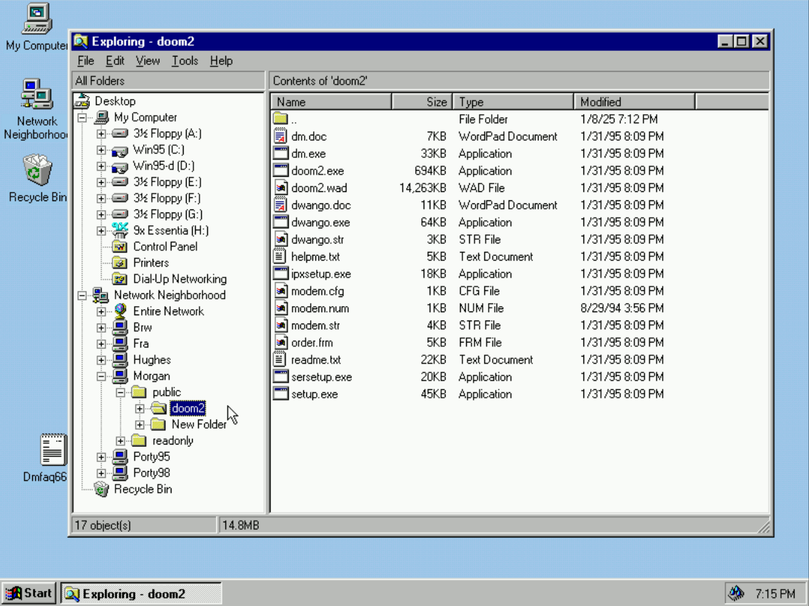
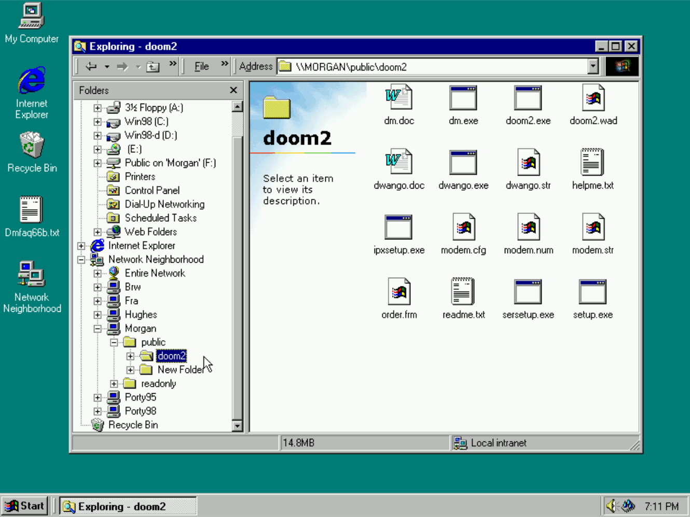
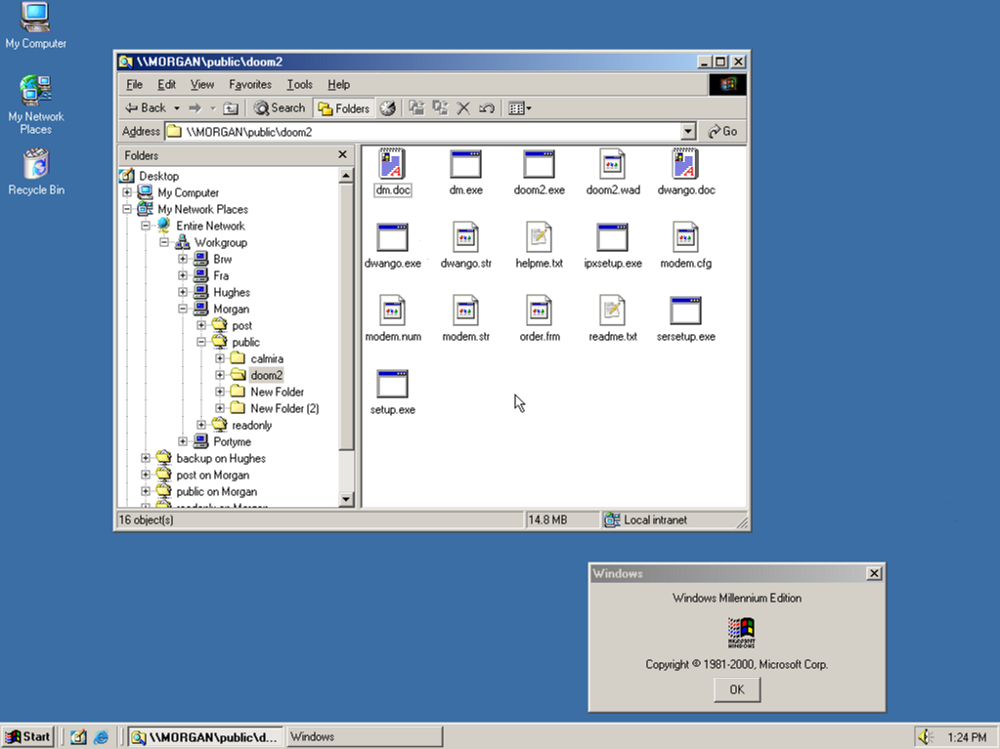
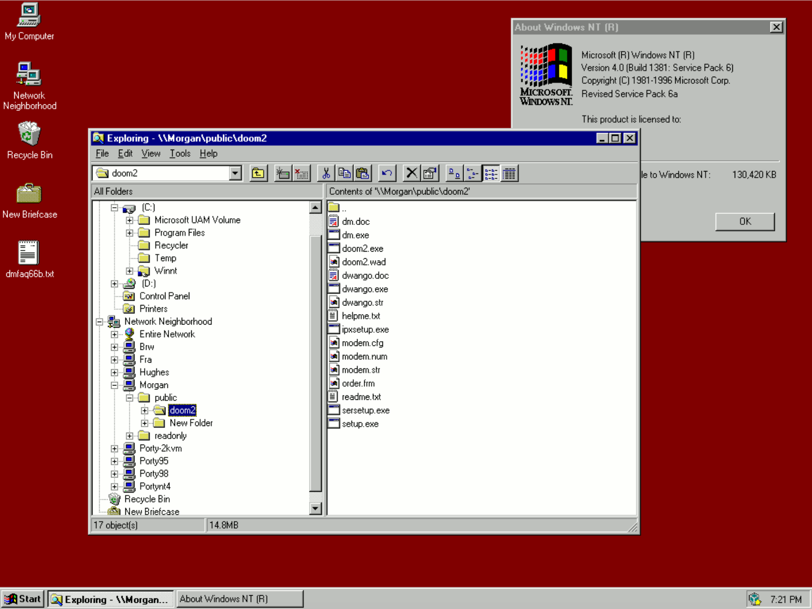
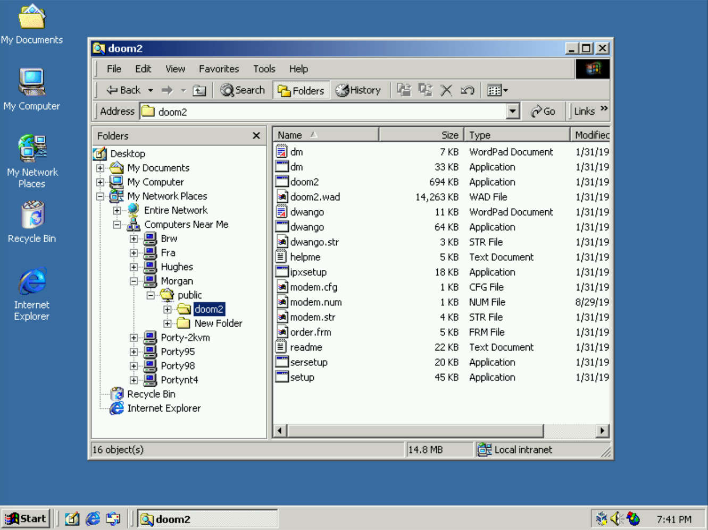
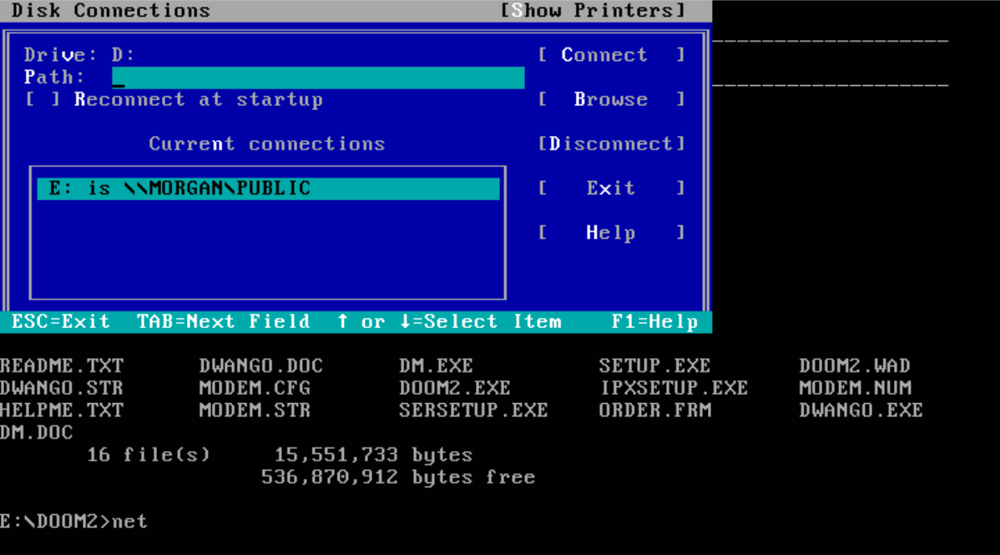

## Windows for Workgroups

(Server description is because the Samba nmbd server is being used) 

## Windows 95

## Windows 98

## Windows ME

## Windows NT 4

## Windows 2000

## OS/2 Warp 4.52

## Microsoft Network Client 3.0 (DOS)

